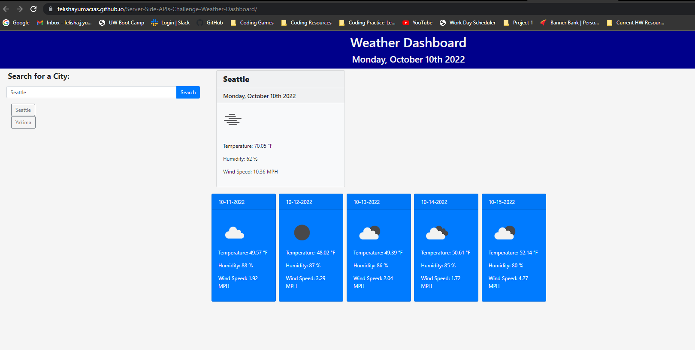

# Server-Side-APIs-Challenge-Weather-Dashboard
Module 6 Challenge

## User Story

```
AS A traveler
I WANT to see the weather outlook for multiple cities
SO THAT I can plan a trip accordingly
```

## Acceptance Criteria

```
GIVEN a weather dashboard with form inputs
WHEN I search for a city
THEN I am presented with current and future conditions for that city and that city is added to the search history
WHEN I view current weather conditions for that city
THEN I am presented with the city name, the date, an icon representation of weather conditions, the temperature, the humidity, and the wind speed
WHEN I view future weather conditions for that city
THEN I am presented with a 5-day forecast that displays the date, an icon representation of weather conditions, the temperature, the wind speed, and the humidity
WHEN I click on a city in the search history
THEN I am again presented with current and future conditions for that city
```

## Usage

Type the name of a city you would like to get weather information on in the search area. Click "Search"
The weather information for today and for the next 5 days should populate on the screen and a button linking to that city should appear beneath the search area.

If you wish to revist cities searched in the past, simply click that city's button.

## Screenshot



## Credits

### Resources Used

Full-Stack Blog on how to use API keys
https://coding-boot-camp.github.io/full-stack/apis/how-to-use-api-keys

Open Weather API
https://openweathermap.org/forecast5

Moment JS
https://cdnjs.cloudflare.com/ajax/libs/moment.js/2.27.0/moment.min.js

jQuery
https://jqueryui.com/demos/

Bootstrap
https://getbootstrap.com/docs/4.5/getting-started/introduction/

## Webpage Links

Link to deployed site
https://felishayumacias.github.io/Server-Side-APIs-Challenge-Weather-Dashboard/

Link to Repo
https://github.com/FelishaYuMacias/Server-Side-APIs-Challenge-Weather-Dashboard

## License

MIT License

Copyright (c) 2022 Felisha

Permission is hereby granted, free of charge, to any person obtaining a copy
of this software and associated documentation files (the "Software"), to deal
in the Software without restriction, including without limitation the rights
to use, copy, modify, merge, publish, distribute, sublicense, and/or sell
copies of the Software, and to permit persons to whom the Software is
furnished to do so, subject to the following conditions:

The above copyright notice and this permission notice shall be included in all
copies or substantial portions of the Software.

THE SOFTWARE IS PROVIDED "AS IS", WITHOUT WARRANTY OF ANY KIND, EXPRESS OR
IMPLIED, INCLUDING BUT NOT LIMITED TO THE WARRANTIES OF MERCHANTABILITY,
FITNESS FOR A PARTICULAR PURPOSE AND NONINFRINGEMENT. IN NO EVENT SHALL THE
AUTHORS OR COPYRIGHT HOLDERS BE LIABLE FOR ANY CLAIM, DAMAGES OR OTHER
LIABILITY, WHETHER IN AN ACTION OF CONTRACT, TORT OR OTHERWISE, ARISING FROM,
OUT OF OR IN CONNECTION WITH THE SOFTWARE OR THE USE OR OTHER DEALINGS IN THE
SOFTWARE.